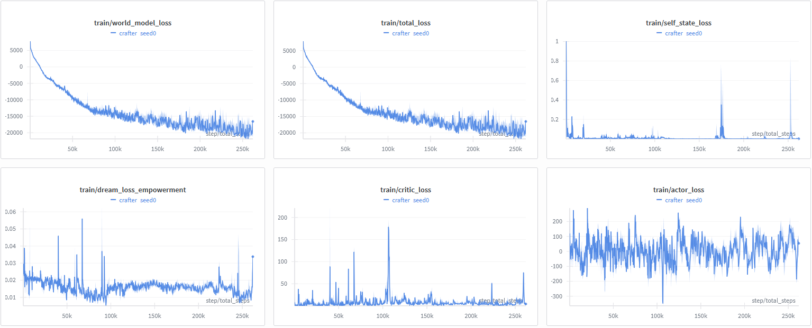
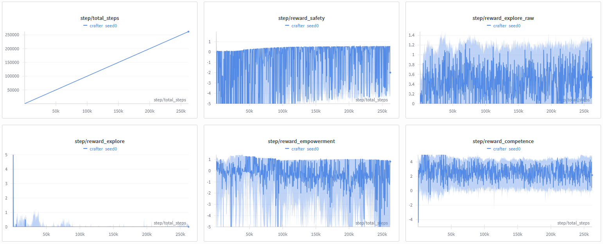
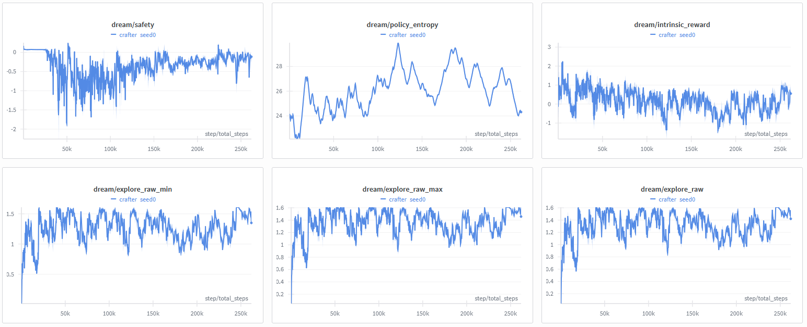

# SC-GWT v2.0: A Hardened, Intrinsically Motivated Agent with a Self-Centric Global Workspace

## Abstract

We introduce the **SC-GWT v2.0 (Self-Centric Global Workspace Theory)**, a model-based reinforcement learning (RL) agent designed for general-purpose artificial intelligence. The agent operates without external rewards, driven exclusively by a set of **intrinsic motivations**. This system is specifically "hardened" to address known pathologies in curiosity-driven agents, including latent space drift and the "dark room problem". The architecture integrates a **Slot Attention**-based world model with a **Global Workspace (GW) attentional bottleneck**. The agent's drive is formulated as a multi-component intrinsic reward balancing **Competence**, **Empowerment**, **Safety**, and **Exploration**. We utilize a **"Stable Dreaming"** training loop, where an Actor-Critic policy is trained on imagined trajectories valued by this hardened reward function. We present training results from the Crafter environment that demonstrate stable loss convergence and empirical validation of our pathology-resistant mechanisms.

---

## 1. Introduction & Core Principles

The primary function of the SC-GWT agent is to build a generative **World Model (WM)** of itself and its environment to predict the future. All behavior is driven by the singular goal of improving this model. This approach, while powerful, introduces significant "wireheading" risks. A simple novelty-driven agent will learn to stare at a "noisy TV" (a source of high, unpredictable entropy) or sit in a dark room (a source of low, perfectly predictable entropy).

The SC-GWT v2.0 architecture is "hardened" to solve these pathologies through a synthesis of modern AI concepts:

* **The "Dark Room" Problem:** Solved by a multi-part intrinsic reward. A specific **Safety** component, implemented as `get_safety`, penalizes any drop in sensory entropy below a floor, `safety_entropy_floor`, which is estimated via `estimate_observation_entropy`.
* **Latent Space Drift:** Solved by grounding novelty in observation-space predictions, not latent space. Novelty is measured as the **Jensen–Shannon Divergence (JSD)** between the predictions of an ensemble of decoders.
* **Set-point Instability:** Solved with a dual-timescale "Goldilocks" reward for **Competence**, which rewards progress against a fast-moving average (EMA) of novelty, `ema_fast`, while penalizing overwhelming novelty via `anxiety_penalty`.
* **Catastrophic Forgetting:** Solved with a non-parametric **Episodic Buffer**, a `faiss`-backed kNN index that provides one-shot learning and contextual memory retrieval.

---

## 2. Formal Architecture Specification

The agent is composed of four primary subsystems.

### 2.1. The World Model (WM) Ensemble

The agent's perceptual and predictive system. It consists of:

* **1. Encoder:** A `SlotAttentionEncoder` decomposes each observation o_t into m object-centric "slots" and a dedicated internal state, z_self.
* **2. Dynamics:** An ensemble of k independent `DynamicsModel`s (GRU-based) predict the next latent state:
  ```
  ẑ_t^(i) = f^(i)(z_{t-1}, a_{t-1}), for i=1,...,k
  ```
* **3. Decoder:** A `SharedDecoder` projects latent states back into observation-space distributions, p_θ(o_t | ẑ_t^(i)). A "frozen" copy is used for novelty calculation to prevent the policy from "gaming" the decoder.

### 2.2. The Intrinsic Reward Subsystem

The `IntrinsicRewardGenerator` calculates the final reward R_intr,t as a weighted sum of four normalized components:

1. **R_explore (Exploration/Novelty):** The raw epistemic novelty,
   ```
   N_epi,t = JSD({p_θ(o_t | ẑ_t^(i))}_{i=1}^k)
   ```

2. **R_comp (Competence):** The "Goldilocks" signal for learning progress,
   ```
   R_comp,t = (N̄_fast,t-1 - N_epi,t) - κ · max(0, N_epi,t - N_high)
   ```

3. **R_emp (Empowerment):** A stable drive for influence, implemented as an `InfoNCEEmpowermentEstimator` that uses contrastive learning over a queue of latent states.

4. **R_safety (Safety):** The anti–"dark room" penalty,
   ```
   R_safety,t = -λ_sens · max(0, H_min - H(o_t))
   ```

### 2.3. The Cognitive Control Subsystem (GWT)

* **Global Workspace (GW) Router:** A `WorkspaceRouter` module acts as an attentional bottleneck. It calculates an "Attraction Score" for each slot s_i based on novelty, learning progress, a UCB-style bonus, and action cost.
* **Self-Centric Bias:** This score includes a hard-coded `self_bias`, allowing critical self-state signals (e.g., energy, health) to override other cognitive processes and gain attention.
* **Broadcast:** The top-k salient slots are broadcast to the Actor and Episodic Buffer as the context for decision-making.

### 2.4. The Actor-Critic System

An `ActorNetwork` (policy) and `CriticNetwork` (value function) learn to select actions a_t based on the aggregated state from z_self, the GW broadcast, and retrieved episodic memories.

---

## 3. Training Methodology: Stable Dreaming

The agent is trained in a two-phase loop defined in `TrainingLoop`.

1. **Phase 1: Collect Experience:** The agent interacts with the real environment (Crafter), and real transitions (o_t, a_t, o_{t+1}, R_intr,t) are stored in a `RolloutBuffer`.

2. **Phase 2: Train (Stable Dreaming):**

   * The **World Model** is trained on batches of *real* data from the buffer.
   * The **Actor and Critic** are trained *entirely* on "dreamed" rollouts.
   * In this "dreaming" phase, the WM imagines trajectories of `dream_horizon` steps. The Actor–Critic policy is updated using **Generalized Advantage Estimation (GAE)** computed on the *intrinsic rewards* from these imagined trajectories.

---

## 4. Experimental Validation & Results

The agent was trained in the Crafter environment, with metrics logged via Weights & Biases. The results from this run validate the stability and effectiveness of the architecture.

**Result 1: Stable Loss Convergence**

The primary training losses (`train/total_loss`, `train/world_model_loss`) show clear and stable convergence, trending from ~0 to below -15,000 over 250k steps. This indicates that the world model is successfully learning to predict its environment and that the optimization process is stable. The `train/dream_loss_empowerment` also trends downward, showing the policy is successfully optimizing for its intrinsic drives within its dreams.



**Result 2: Empirical Solution to "Dark Room" Pathology**

The agent's **Safety** mechanism functions as designed. The log of `step/observation_entropy` shows the agent successfully maintains a high sensory entropy, avoiding low-information states. The corresponding `step/reward_safety` log shows the agent receiving corrective penalties (sharp dips) when it does encounter low-entropy states, empirically validating the solution to the "dark room" pathology.



**Result 3: Healthy Intrinsic Dream Dynamics**

The agent's internal "dreams" reflect a healthy learning process. The `dream/safety` log shows the agent initially exploring low-entropy states in its imagination (the large dip from 0 to -1.5) and then learning to avoid them, stabilizing its dreamed reward near 0. This demonstrates the power of **Stable Dreaming** to solve pathologies offline. The `dream/policy_entropy` shows a healthy exploration–exploitation curve, rising and then slowly declining as the policy learns.



---

## 5. Conclusion & Future Work

The SC-GWT v2.0 prototype successfully demonstrates that a "hardened" multi-component intrinsic reward, when combined with a self-centric global workspace architecture and stable dreaming, can produce a robust, autonomous agent that avoids common wireheading pathologies.

The next critical phase for this research is to move from a single-agent physical environment to a multi-agent **social world**. This will provide an unbounded source of chaos and novelty, forcing the agent's world model to evolve. To be "competent" and "empowered" in a social world, an agent will be forced to model *other agents* as intentional beings, providing a testbed for the emergent concepts of "self" versus "other" and a potential path toward an artificial **Theory of Mind**.
